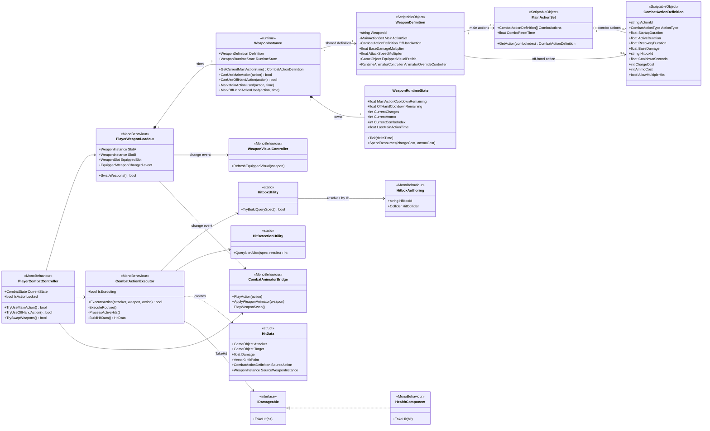
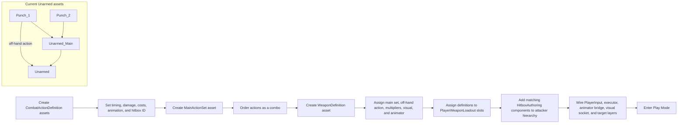
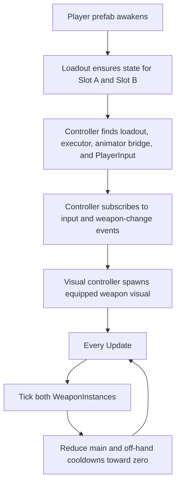
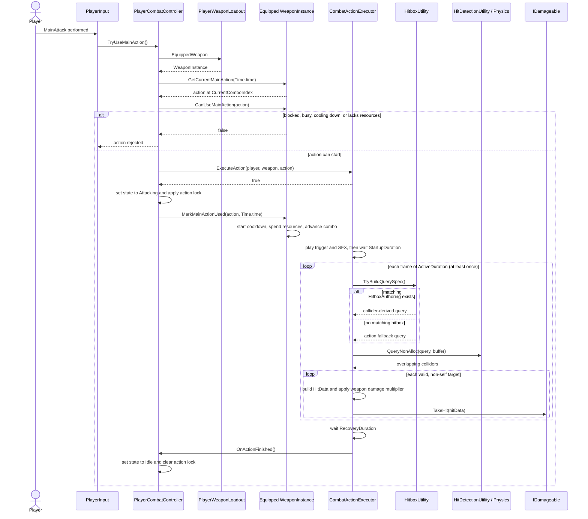
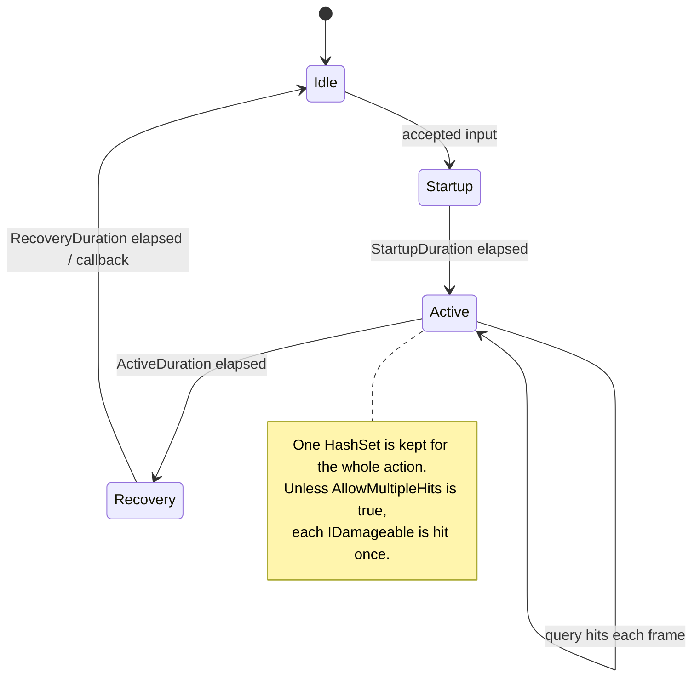
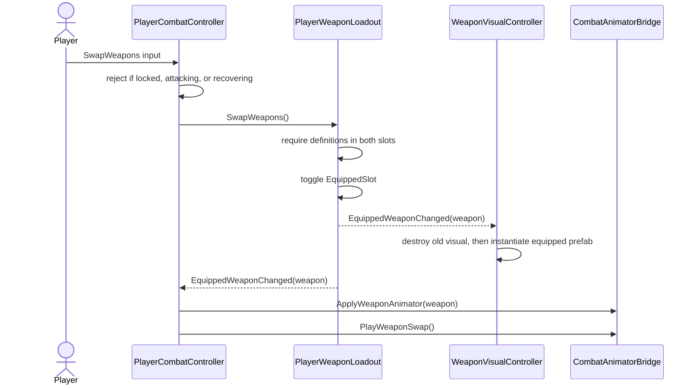
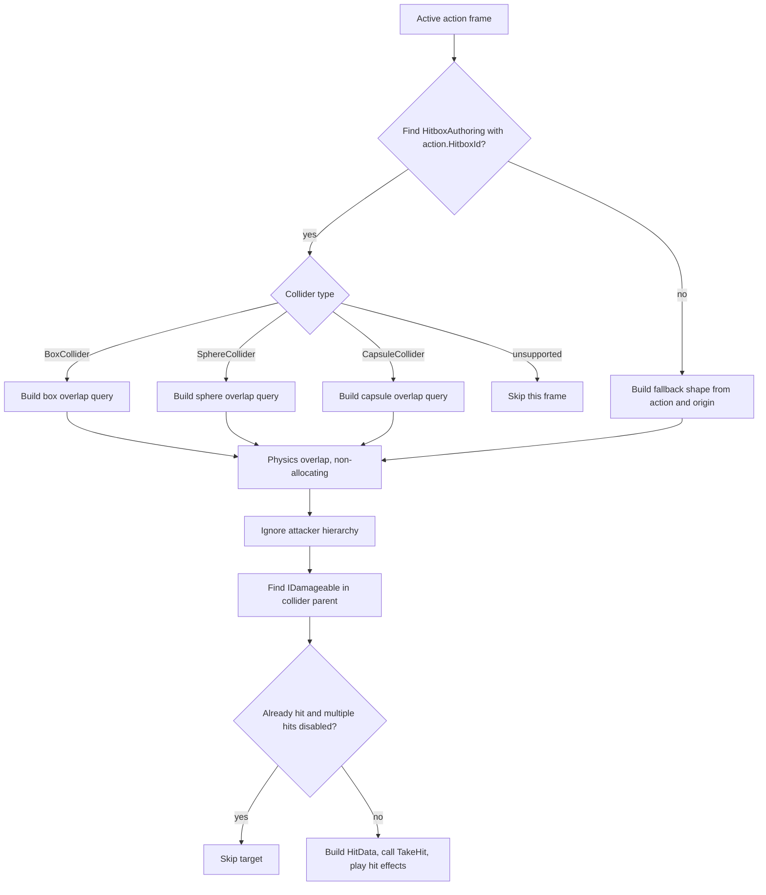

# Combat and Weapon System

This document separates the shared, editor-authored definitions from the mutable objects created for each player at runtime.

## System Map

## Development-Time Authoring

Definitions are project assets and should remain immutable during play. Runtime counters belong to `WeaponRuntimeState`, not the assets.

## Runtime Object Creation and Updates

## Main Attack Execution

Off-hand execution follows the same sequence, except it selects the **inactive** weapon's `OffHandAction` and uses that weapon's off-hand cooldown.

## Action Lifecycle

The controller currently reports `CombatState.Attacking` for startup, active, and recovery. The lifecycle above describes the executor coroutine rather than distinct controller states.

## Weapon Swap

## Hit Detection Decision

## Current Implementation Notes

- `WeaponDefinition.AttackSpeedMultiplier` is authored but is not applied to startup, active, or recovery timing.
- `LockMovement`, `CanRotateDuringAction`, and `CanStartInAir` are authored but are not consumed by the shown runtime classes.
- `CombatState.Recovering` is checked but never assigned; the controller remains `Attacking` until the executor completes recovery.
- `CanBeCancelled` and `CanInterruptRecovery` cannot currently start a replacement action because `CombatActionExecutor.IsExecuting` rejects it first.
- An action trigger can be sent by both `CombatAnimatorBridge` and `CombatActionExecutor` when both reference an animator.
- `AllowMultipleHits` bypasses the per-action de-duplication set, so a target may receive a hit on every active frame.
- `Hitbox` is a legacy trigger-driven path; new actions use `CombatActionExecutor` and physics overlap queries.
